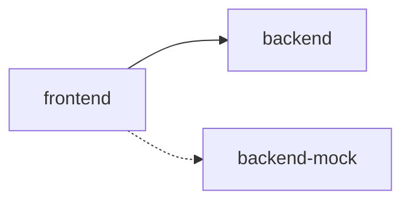
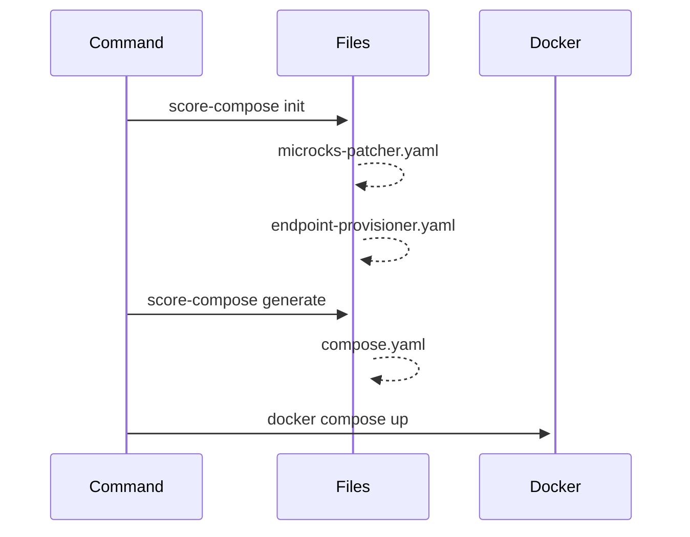
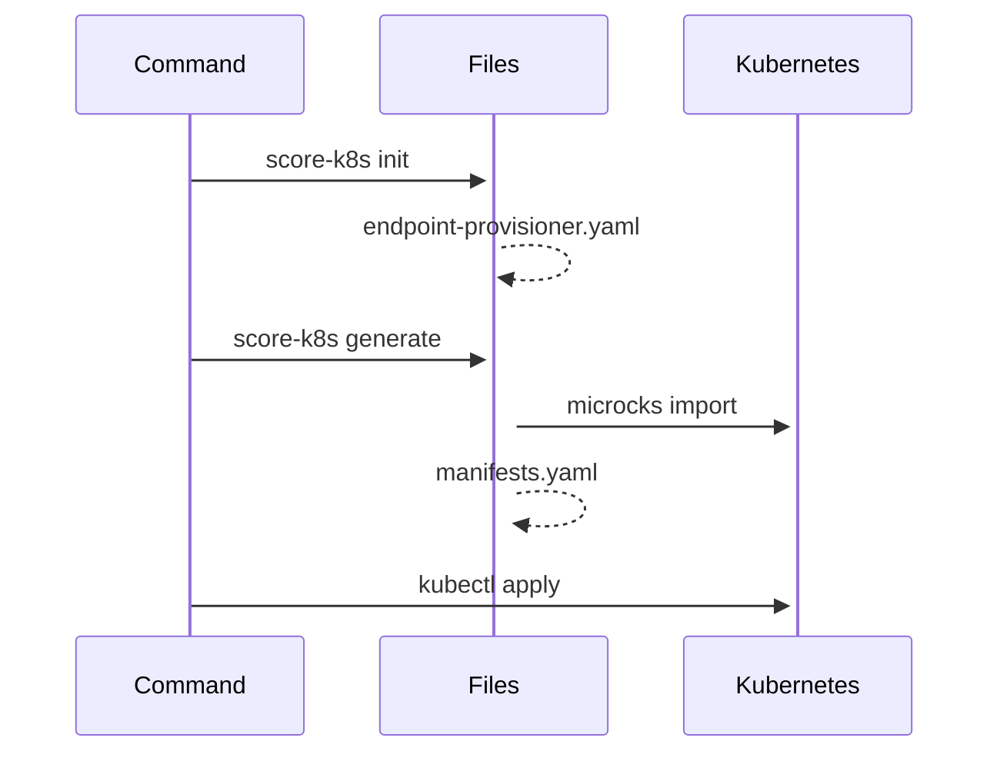

# score-microcks

[](https://codespaces.new/mathieu-benoit/score-microcks)



## `score-compose`



```bash
make compose-up
```

Navigate to the Microcks UI:
```bash
echo -e "http://localhost:9090"
```

Test the endpoint registered:
```bash
curl -X POST 'http://localhost:9090/rest/Order+Service+API/0.1.0/orders' \
    -H 'Content-Type: application/json' \
    -H 'Accept: application/json' \
    -d '{"customerId":"lbroudoux","productQuantities":[{"productName":"Millefeuille","quantity":1},{"productName":"Eclair Cafe","quantity":2}],"totalPrice":9.4}'
```

## `score-k8s`



Create a Kind cluster if you need one:
```bash
make kind-create-cluster
```

Navigate to the Microcks UI:
```bash
echo -e "https://microcks.127.0.0.1.nip.io"
```

```bash
make k8s-up
```

## Resources

- https://microcks.io/documentation/guides/installation/docker-compose/
- https://microcks.io/documentation/guides/installation/kubernetes-operator/
- https://github.com/microcks/api-lifecycle/tree/master/shift-left-demo
- https://hub.microcks.io/